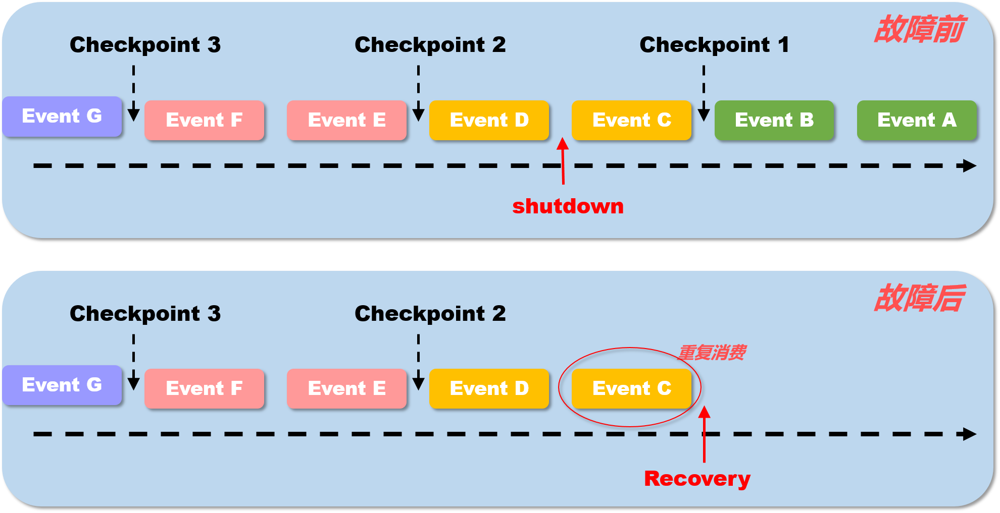

## flink具体是如何实现exactly once 语义

在谈到 flink 所实现的 exactly-once语义时,主要是2个层面上的,首先 flink在0.9版本以后已经实现了基于state的内部一致性语义, 在1.4版本以后也可以实现端到端 Exactly-Once语义

- #### 状态 Exactly-Once

  Flink 提供 exactly-once 的状态（state）投递语义，这为有状态的（stateful）计算提供了准确性保证。也就是状态是不会重复使用的,有且仅有一次消费

​	这里需要注意的一点是如何理解state语义的exactly-once,并不是说在flink中的所有事件均只会处理一次,而是所有的事件所影响生成的state只有作用一次.

​	在上图中, 假设每两条消息后出发一次checkPoint操作,持久化一次state. TaskManager 在 处理完 event c 之后被shutdown, 这时候当 JobManager重启task之后, TaskManager  会从 checkpoint 1 处恢复状态,重新执行流处理,也就是说 此时 event c 事件 的的确确是会被再一次处理的. 那么 这里所说的一致性语义是何意思呢? 本身,flink每处理完一条数据都会记录当前进度到 state中, 也就是说在 故障前, 处理完 event c 这件事情已经记录到了state中,但是,由于在checkPoint 2 之前, 就已经发生了宕机,那么 event c 对于state的影响并没有被记录下来,对于整个flink内部系统来说就好像没有发生过一样, 在 故障恢复后, 当触发 checkpoint 2 时, event c 的 state才最终被保存下来. **所以说,可以这样理解, 进入flink 系统中的 事件 永远只会被 一次state记录并checkpoint下来,而state是永远不会发生重复被消费的, 这也就是 flink内部的一致性语义,就叫做 状态 Exactly once.**

- #### 端到端（end-to-end）Exactly-Once

2017年12月份发布的Apache Flink 1.4版本，引进了一个重要的特性：TwoPhaseCommitSinkFunction.，它抽取了两阶段提交协议的公共部分，使得构建端到端Excatly-Once的Flink程序变为了可能。这些外部系统包括Kafka0.11及以上的版本，以及一些其他的数据输入（data sources）和数据接收(data sink)。它提供了一个抽象层，需要用户自己手动去实现Exactly-Once语义.

为了提供端到端Exactly-Once语义，除了Flink应用程序本身的状态，Flink写入的外部存储也需要满足这个语义。也就是说，这些外部系统必须提供提交或者回滚的方法，然后通过Flink的checkpoint来协调

[参考文章1](<https://www.whitewood.me/2018/10/16/Flink-Exactly-Once-%E6%8A%95%E9%80%92%E5%AE%9E%E7%8E%B0%E6%B5%85%E6%9E%90/>)

[参考文章2](<https://my.oschina.net/u/992559/blog/1819948>)

