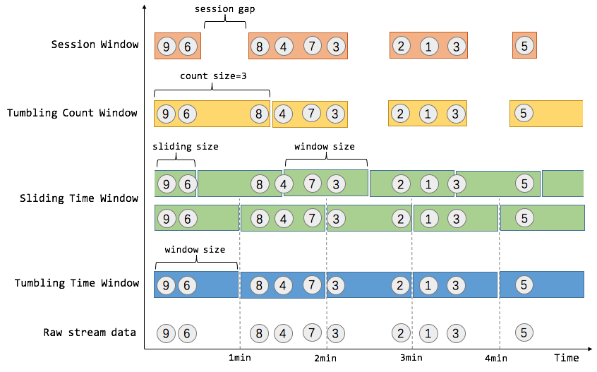

## flink 的 window 分类

**flink中的窗口主要分为3大类共5种窗口**:

- **Time Window 时间窗口**

  - **Tumbing Time Window 滚动时间窗口**

    实现统计每一分钟(或其他长度)窗口内 计算的效果

  - **Sliding Time Window 滑动时间窗口**

    实现每过xxx时间 统计 xxx时间窗口的效果. 比如，我们可以每30秒计算一次最近一分钟用户购买的商品总数。

- **Count Window 计数窗口**

  - **Tumbing Count Window  滚动计数窗口**

    当我们想要每100个用户购买行为事件统计购买总数，那么每当窗口中填满100个元素了，就会对窗口进行计算，这种窗口我们称之为翻滚计数窗口（Tumbling Count Window）

  - **Sliding Count Window   滑动计数窗口**

    和Sliding Time Window含义是类似的，例如计算每10个元素计算一次最近100个元素的总和

- **Session Window  会话窗口**

  在这种用户交互事件流中，我们首先想到的是将事件聚合到会话窗口中（一段用户持续活跃的周期），由非活跃的间隙分隔开。如上图所示，就是需要计算每个用户在活跃期间总共购买的商品数量，如果用户30秒没有活动则视为会话断开（假设raw data stream是单个用户的购买行为流）