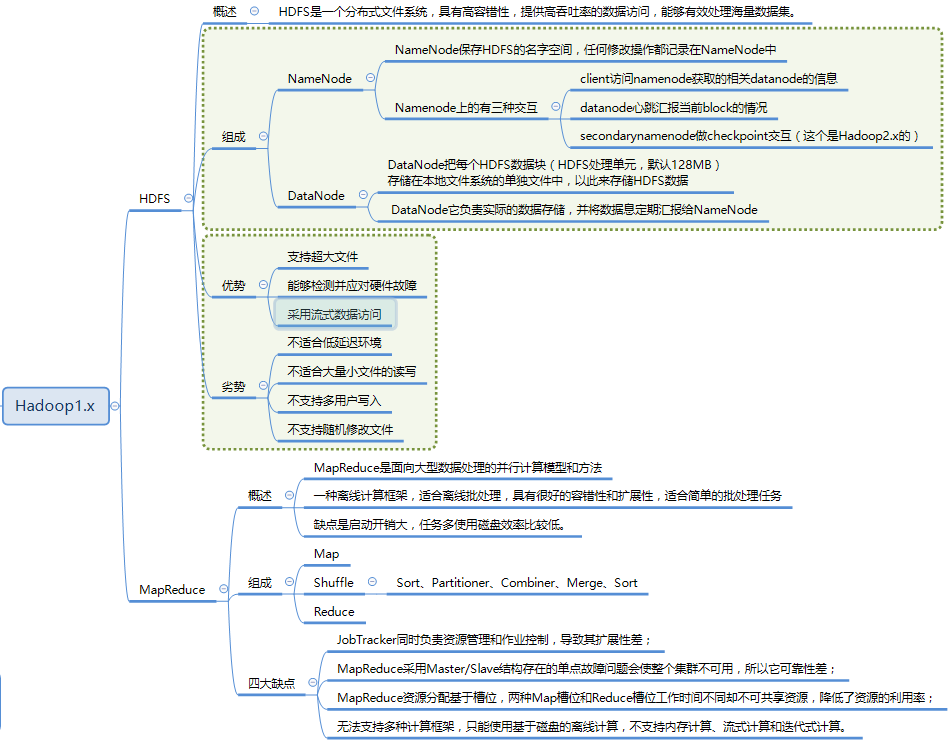
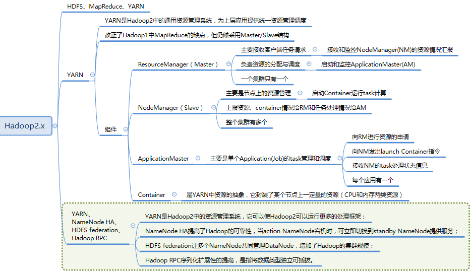

## hadoop1.x 和hadoop 2.x 的区别

1. **资源调度方式的改变**

   在1.x, 使用Jobtracker负责任务调度和资源管理,单点负担过重,在2.x中,新增了yarn作为集群的调度工具.在yarn中,使用ResourceManager进行 资源管理, 单独开启一个Container作为ApplicationMaster来进行任务管理.

2. **HA模式**

   在1.x中没有HA模式,集群中只有一个NameNode,而在2.x中可以启用HA模式,存在一个Active NameNode 和Standby NameNode.

3. **HDFS Federation**

   Hadoop 2.0中对HDFS进行了改进，使NameNode可以横向扩展成多个，每个NameNode分管一部分目录，进而产生了HDFS Federation，该机制的引入不仅增强了HDFS的扩展性，也使HDFS具备了隔离性

