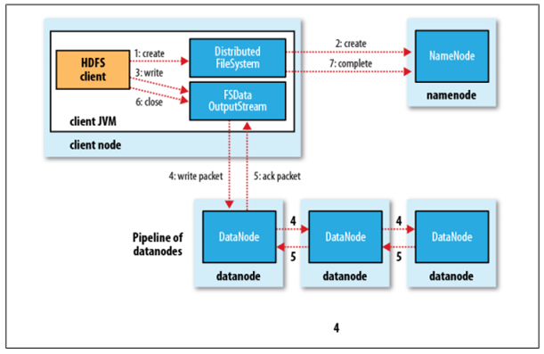

## hdfs写流程

1. Client 调用 DistributedFileSystem 对象的 `create` 方法，创建一个文件输出流（FSDataOutputStream）对象；
2. 通过 DistributedFileSystem 对象与集群的 NameNode 进行一次 RPC 远程调用，在 HDFS 的 Namespace 中创建一个文件条目（Entry），此时该条目没有任何的 Block，NameNode 会返回该数据每个块需要拷贝的 DataNode 地址信息；
3. 通过 FSDataOutputStream 对象，开始向 DataNode 写入数据，数据首先被写入 FSDataOutputStream 对象内部的数据队列中，数据队列由 DataStreamer 使用，它通过选择合适的 DataNode 列表来存储副本，从而要求 NameNode 分配新的 block；
4. DataStreamer 将数据包以流式传输的方式传输到分配的第一个 DataNode 中，该数据流将数据包存储到第一个 DataNode 中并将其转发到第二个 DataNode 中，接着第二个 DataNode 节点会将数据包转发到第三个 DataNode 节点；
5. DataNode 确认数据传输完成，最后由第一个 DataNode 通知 client 数据写入成功；
6. 完成向文件写入数据，Client 在文件输出流（FSDataOutputStream）对象上调用 `close` 方法，完成文件写入；
7. 调用 DistributedFileSystem 对象的 complete 方法，通知 NameNode 文件写入成功，NameNode 会将相关结果记录到 editlog 中。