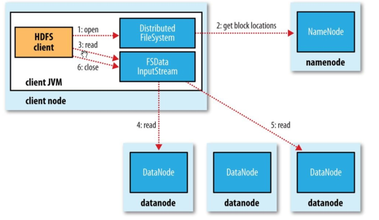

## hdfs读流程

1. Client 通过 DistributedFileSystem 对象与集群的 NameNode 进行一次 RPC 远程调用，获取文件 block 位置信息；
2. NameNode 返回存储的每个块的 DataNode 列表；
3. Client 将连接到列表中最近的 DataNode；
4. Client 开始从 DataNode 并行读取数据；
5. 一旦 Client 获得了所有必须的 block，它就会将这些 block 组合起来形成一个文件。