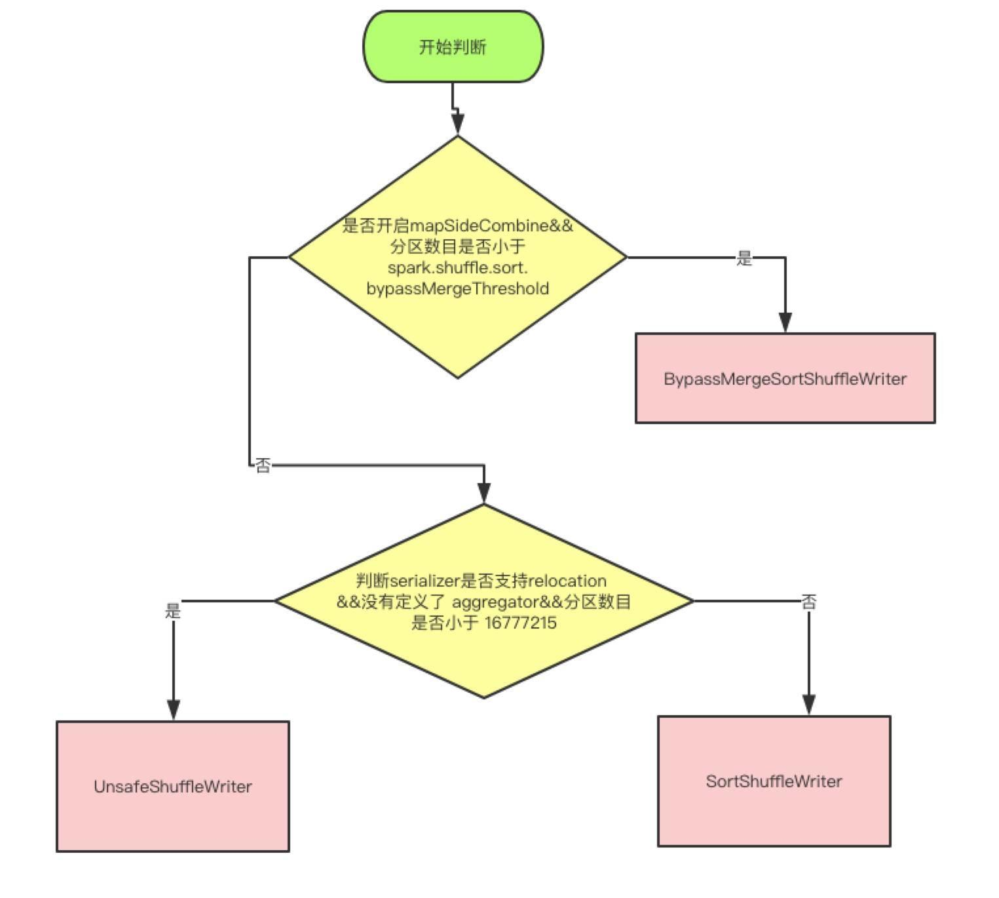

## spark的shuffle介绍

**spark中的shuffle主要有3种:**

- **Hash Shuffle** 2.0以后移除

  

  在map阶段(shuffle write)，每个map都会为下游stage的每个partition写一个临时文件，假如下游stage有1000个partition，那么每个map都会生成1000个临时文件，一般来说一个executor上会运行多个map task，这样下来，一个executor上会有非常多的临时文件，假如一个executor上运行M个map task，下游stage有N个partition，那么一个executor上会生成M*N个文件。另一方面，如果一个executor上有K个core，那么executor同时可运行K个task，这样一来，就会同时申请K*N个文件描述符，一旦partition数较多，势必会耗尽executor上的文件描述符，同时生成K*N个write handler也会带来大量内存的消耗。

  在reduce阶段(shuffle read)，每个reduce task都会拉取所有map对应的那部分partition数据，那么executor会打开所有临时文件准备网络传输，这里又涉及到大量文件描述符，另外，如果reduce阶段有combiner操作，那么它会把网络中拉到的数据保存在一个`HashMap`中进行合并操作，如果数据量较大，很容易引发OOM操作。

- **Sort Shuffle** 1.1开始(sort shuffle也经历过优化升级,详细见参考文章1)

  

  在map阶段(shuffle write)，会按照partition id以及key对记录进行排序，将所有partition的数据写在同一个文件中，该文件中的记录首先是按照partition id排序一个一个分区的顺序排列，每个partition内部是按照key进行排序存放，map task运行期间会顺序写每个partition的数据，并通过一个索引文件记录每个partition的大小和偏移量。这样一来，每个map task一次只开两个文件描述符，一个写数据，一个写索引，大大减轻了Hash Shuffle大量文件描述符的问题，即使一个executor有K个core，那么最多一次性开K*2个文件描述符。

  在reduce阶段(shuffle read)，reduce task拉取数据做combine时不再是采用`HashMap`，而是采用`ExternalAppendOnlyMap`，该数据结构在做combine时，如果内存不足，会刷写磁盘，很大程度的保证了鲁棒性，避免大数据情况下的OOM。

- **Unsafe Shuffle** 1.5开始, 1.6与Sort shuffle合并

  从spark 1.5.0开始，spark开始了钨丝计划(Tungsten)，目的是优化内存和CPU的使用，进一步提升spark的性能。为此，引入Unsafe Shuffle，它的做法是将数据记录用二进制的方式存储，直接在序列化的二进制数据上sort而不是在java 对象上，这样一方面可以减少memory的使用和GC的开销，另一方面避免shuffle过程中频繁的序列化以及反序列化。在排序过程中，它提供cache-efficient sorter，使用一个8 bytes的指针，把排序转化成了一个指针数组的排序，极大的优化了排序性能.

------

**现在2.1 分为三种writer， 分为 BypassMergeSortShuffleWriter， SortShuffleWriter 和 UnsafeShuffleWriter**

#### 三种Writer的分类

上面是使用哪种 writer 的判断依据， 是否开启 mapSideCombine 这个判断，是因为有些算子会在 map 端先进行一次 combine， 减少传输数据。 因为 BypassMergeSortShuffleWriter 会临时输出Reducer个（分区数目）小文件，所以分区数必须要小于一个阀值，默认是小于200

UnsafeShuffleWriter需要Serializer支持relocation，Serializer支持relocation：原始数据首先被序列化处理，并且再也不需要反序列，在其对应的元数据被排序后，需要Serializer支持relocation，在指定位置读取对应数据

[参考文章1](<http://sharkdtu.com/posts/spark-shuffle.html>)

[参考文章2](<http://spark.coolplayer.net/?p=576>)