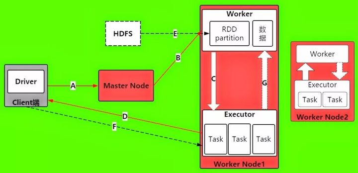

## 一个spark程序的执行流程

- **A ->** 当 Driver 进程被启动之后,首先它将发送请求到Master节点上,进行Spark应用程序的注册
- **B ->** Master在接受到Spark应用程序的注册申请之后,会发送给Worker,让其进行资源的调度和分配.
- **C ->** Worker 在接受Master的请求之后,会为Spark应用程序启动Executor, 来分配资源
- **D ->** Executor启动分配资源好后,就会想Driver进行反注册,这是Driver已经知道哪些Executor为他服务了
- **E ->** 当Driver得到注册了Executor之后,就可以开始正式执行spark应用程序了. 首先第一步,就是创建初始RDD,读取数据源,再执行之后的一系列算子. HDFS文件内容被读取到多个worker节点上,形成内存中的分布式数据集,也就是初始RDD
- **F ->** Driver就会根据 Job 任务任务中的算子形成对应的task,最后提交给 Executor, 来分配给task进行计算的线程
- **G ->** task就会去调用对应的任务数据来计算,并task会对调用过来的RDD的partition数据执行指定的算子操作,形成新的RDD的partition,这时一个大的循环就结束了
- 后续的RDD的partition数据又通过Driver形成新的一批task提交给Executor执行,循环这个操作,直到所有的算子结束

[参考文章](<https://zhuanlan.zhihu.com/p/35713084>)