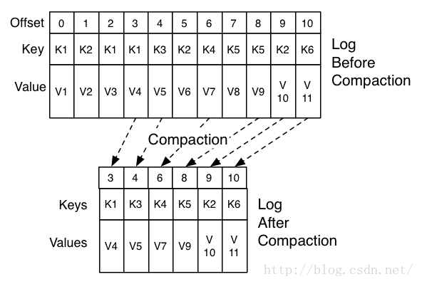

## 如何清理过期数据

- #### 删除

  log.cleanup.policy=delete启用删除策略

  - 直接删除，删除后的消息不可恢复。可配置以下两个策略：
    清理超过指定时间清理：  
    log.retention.hours=16
  - 超过指定大小后，删除旧的消息：
    log.retention.bytes=1073741824
    为了避免在删除时阻塞读操作，采用了copy-on-write形式的实现，删除操作进行时，读取操作的二分查找功能实际是在一个静态的快照副本上进行的，这类似于Java的CopyOnWriteArrayList。

- #### 压缩

  将数据压缩，只保留每个key最后一个版本的数据。
  首先在broker的配置中设置log.cleaner.enable=true启用cleaner，这个默认是关闭的。
  在topic的配置中设置log.cleanup.policy=compact启用压缩策略。

  

  如上图，在整个数据流中，每个Key都有可能出现多次，压缩时将根据Key将消息聚合，只保留最后一次出现时的数据。这样，无论什么时候消费消息，都能拿到每个Key的最新版本的数据。
  压缩后的offset可能是不连续的，比如上图中没有5和7，因为这些offset的消息被merge了，当从这些offset消费消息时，将会拿到比这个offset大的offset对应的消息，比如，当试图获取offset为5的消息时，实际上会拿到offset为6的消息，并从这个位置开始消费。
  这种策略只适合特俗场景，比如消息的key是用户ID，消息体是用户的资料，通过这种压缩策略，整个消息集里就保存了所有用户最新的资料。
  压缩策略支持删除，当某个Key的最新版本的消息没有内容时，这个Key将被删除，这也符合以上逻辑。

[参考文章](<https://blog.csdn.net/honglei915/article/details/49683065>)

