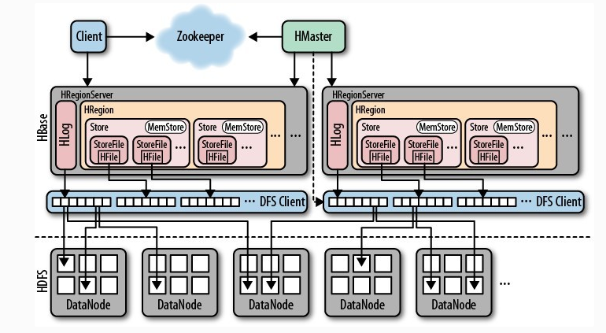

## 讲一下 Hbase 架构

**Hbase主要包含HMaster/HRegionServer/Zookeeper**

- **HRegionServer 负责实际数据的读写. 当访问数据时, 客户端直接与RegionServer通信.**

  HBase的表根据Row Key的区域分成多个Region, 一个Region包含这这个区域内所有数据. 而Region server负责管理多个Region, 负责在这个Region server上的所有region的读写操作. 

- **HMaster 负责管理Region的位置, DDL(新增和删除表结构)**

  - 协调RegionServer
  - 在集群处于数据恢复或者动态调整负载时,分配Region到某一个RegionServer中
  - 管控集群,监控所有Region Server的状态
  - 提供DDL相关的API, 新建(create),删除(delete)和更新(update)表结构.

- **Zookeeper 负责维护和记录整个Hbase集群的状态**

  zookeeper探测和记录Hbase集群中服务器的状态信息.如果zookeeper发现服务器宕机,它会通知Hbase的master节点.