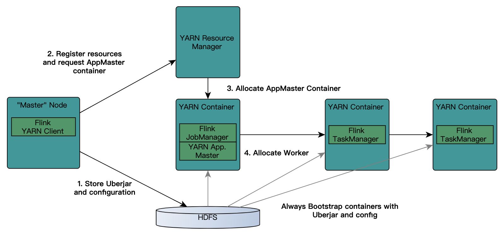

## 讲一下flink on yarn的部署

Flink作业提交有两种类型:

- #### yarn session

  需要先启动集群，然后在提交作业，接着会向yarn申请一块空间后，资源永远保持不变。如果资源满了，下一个作业就无法提交，只能等到yarn中的其中一个作业执行完成后，释放了资源，那下一个作业才会正常提交.

  - 客户端模式

    对于客户端模式而言，你可以启动多个yarn session，一个yarn session模式对应一个JobManager,并按照需求提交作业，同一个Session中可以提交多个Flink作业。如果想要停止Flink Yarn Application，需要通过yarn application -kill命令来停止.

  - 分离式模式

    对于分离式模式，并不像客户端那样可以启动多个yarn session，如果启动多个，会出现下面的session一直处在等待状态。JobManager的个数只能是一个，同一个Session中可以提交多个Flink作业。如果想要停止Flink Yarn Application，需要通过yarn application -kill命令来停止

- #### Flink run(Per-Job)

  直接在YARN上提交运行Flink作业(Run a Flink job on YARN)，这种方式的好处是一个任务会对应一个job,即没提交一个作业会根据自身的情况，向yarn申请资源，直到作业执行完成，并不会影响下一个作业的正常运行，除非是yarn上面没有任何资源的情况下

| Session                          |                                  |
| -------------------------------- | -------------------------------- |
| 共享Dispatcher和Resource Manager | Dispatcher和Resource Manager     |
| 共享资源(即 TaskExecutor)        | 按需要申请资源 (即 TaskExecutor) |
| 适合规模小,执行时间短的作业      |                                  |

