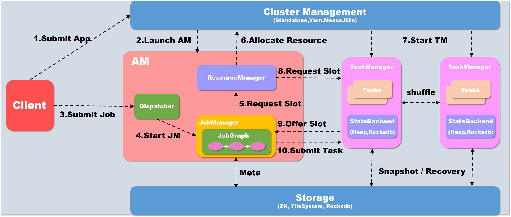

## 讲一下flink的作业执行流程

 

**以yarn模式Per-job方式为例概述作业提交执行流程**

1. 当执行executor() 之后,会首先在本地client 中将代码转化为可以提交的 JobGraph

   如果提交为Per-Job模式,则首先需要启动AM, client会首先向资源系统申请资源, 在yarn下即为申请container开启AM, 如果是Session模式的话则不需要这个步骤

2. Yarn分配资源, 开启AM
3. Client将Job提交给Dispatcher
4. Dispatcher 会开启一个新的 JobManager线程
5. JM 向Flink 自己的 Resourcemanager申请slot资源来执行任务
6. RM 向 Yarn申请资源来启动 TaskManger (Session模式跳过此步)
7. Yarn 分配 Container 来启动 taskManger (Session模式跳过此步)
8. Flink 的 RM 向 TM 申请 slot资源来启动 task
9. TM 将待分配的 slot 提供给 JM
10. JM 提交 task, TM 会启动新的线程来执行任务,开始启动后就可以通过 shuffle模块进行 task之间的数据交换

[参考视频](<https://www.bilibili.com/video/av52394455?t=343>)