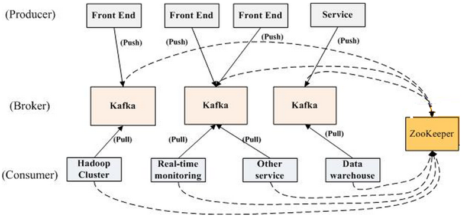

## 讲一下kafka 的架构

- **Producer**：消息生产者

  - Producer可以发送消息到Topic

  - - Topic的消息存放在不同Partition中，不同Partition存放在不同Broker中
    - Producer只需要指定Topic的名字、要连接到的Broker，这样Kafka就可以自动地把消息数据路由到合适的Broker（不一定是指定连接的Broker）

  - Producer发送消息后，可以选择是否要确认消息写入成功（ACK，Acknowledgment）

  - - ACK=0：Producer不会等待ACK（消息可能丢失）
    - ACK=1：Producer会等待Leader Partition的ACK（Follower Partition消息可能丢失）
    - ACK=all：Producer会等待Leader Partition和Follower Partition的ACK（消息不会丢失）

  - 消息key：Producer可以给消息加上key，带相同key的消息会被分发到同一个Partition，这样就可以保证带相同key的消息的消费是有序的

- **Broker**：每个Broker里包含了不同Topic的不同Partition，Partition中包含了有序的消息

  - 一个Kafka集群由多个Broker（server）组成
  - 每个Broker都有ID标识
  - 每个Broker里保存一定数量的Partition
  - 客户端只要连接上任意一个Broker，就可以连接上整个Kafka集群
  - 大多数Kafka集群刚开始的时候建议使用至少3个Broker，集群大了可以有上百个Broker

- **Consumer**：消息消费者

  - Consumer可以从Topic读取消息进行消费

  - - Topic的消息存放在不同Partition中，不同Partition存放在不同Broker中
    - Consumer只需要指定Topic的名字、要连接到的Broker，这样Kafka就可以自动地把Consumer路由到合适的Broker拉取消息进行消费（不一定是指定连接的Broker）
    - 每一个Partition中的消息都会被有序消费

  - Consumer Group：

  - - Consumer Group由多个Consumer组成
    - Consumer Group里的每个Consumer都会从不同的Partition中读取消息
    - 如果Consumer的数量大于Partition的数量，那么多出来的Consumer就会空闲下来（浪费资源）

  - Consumer offset：

  - - Kafka会为Consumer Group要消费的每个Partion保存一个offset，这个offset标记了该Consumer Group最后消费消息的位置
    - 这个offset保存在Kafka里一个名为“__consumer_offsets”的Topic中；当Consumer从Kafka拉取消息消费时，同时也要对这个offset提交修改更新操作。这样若一个Consumer消费消息时挂了，其他Consumer可以通过这个offset值重新找到上一个消息再进行处理

[参考文章](<https://zhuanlan.zhihu.com/p/48896367>)

