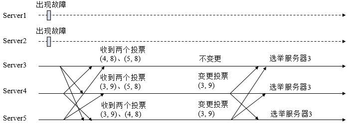

## 讲一下leader 选举过程

　　这里选取3台机器组成的服务器集群为例。在集群初始化阶段，当有一台服务器Server1启动时，其单独无法进行和完成Leader选举，当第二台服务器Server2启动时，此时两台机器可以相互通信，每台机器都试图找到Leader，于是进入Leader选举过程。选举过程如下

　　**(1) 每个Server发出一个投票**。由于是初始情况，Server1和Server2都会将自己作为Leader服务器来进行投票，每次投票会包含所推举的服务器的myid和ZXID，使用(myid, ZXID)来表示，此时Server1的投票为(1, 0)，Server2的投票为(2, 0)，然后各自将这个投票发给集群中其他机器。

　　**(2) 接受来自各个服务器的投票**。集群的每个服务器收到投票后，首先判断该投票的有效性，如检查是否是本轮投票、是否来自LOOKING状态的服务器。

　　**(3) 处理投票**。针对每一个投票，服务器都需要将别人的投票和自己的投票进行PK，PK规则如下

　　　　**· 优先检查ZXID**。ZXID比较大的服务器优先作为Leader。

　　　　**· 如果ZXID相同，那么就比较myid**。myid较大的服务器作为Leader服务器。

　　对于Server1而言，它的投票是(1, 0)，接收Server2的投票为(2, 0)，首先会比较两者的ZXID，均为0，再比较myid，此时Server2的myid最大，于是更新自己的投票为(2, 0)，然后重新投票，对于Server2而言，其无须更新自己的投票，只是再次向集群中所有机器发出上一次投票信息即可。

　　**(4) 统计投票**。每次投票后，服务器都会统计投票信息，判断是否已经有过半机器接受到相同的投票信息，对于Server1、Server2而言，都统计出集群中已经有两台机器接受了(2, 0)的投票信息，此时便认为已经选出了Leader。

　　**(5) 改变服务器状态**。一旦确定了Leader，每个服务器就会更新自己的状态，如果是Follower，那么就变更为FOLLOWING，如果是Leader，就变更为LEADING。

### Leader选举算法分析

在3.4.0后的Zookeeper的版本只保留了TCP版本的FastLeaderElection选举算法。当一台机器进入Leader选举时，当前集群可能会处于以下两种状态

　　　　· 集群中已经存在Leader。

　　　　· 集群中不存在Leader。

　　对于集群中已经存在Leader而言，此种情况一般都是某台机器启动得较晚，在其启动之前，集群已经在正常工作，对这种情况，该机器试图去选举Leader时，会被告知当前服务器的Leader信息，对于该机器而言，仅仅需要和Leader机器建立起连接，并进行状态同步即可。而在集群中不存在Leader情况下则会相对复杂，其步骤如下

　　(1) **第一次投票**。无论哪种导致进行Leader选举，集群的所有机器都处于试图选举出一个Leader的状态，即LOOKING状态，LOOKING机器会向所有其他机器发送消息，该消息称为投票。投票中包含了SID（服务器的唯一标识）和ZXID（事务ID），(SID, ZXID)形式来标识一次投票信息。假定Zookeeper由5台机器组成，SID分别为1、2、3、4、5，ZXID分别为9、9、9、8、8，并且此时SID为2的机器是Leader机器，某一时刻，1、2所在机器出现故障，因此集群开始进行Leader选举。在第一次投票时，每台机器都会将自己作为投票对象，于是SID为3、4、5的机器投票情况分别为(3, 9)，(4, 8)， (5, 8)。

　　(2) **变更投票**。每台机器发出投票后，也会收到其他机器的投票，每台机器会根据一定规则来处理收到的其他机器的投票，并以此来决定是否需要变更自己的投票，这个规则也是整个Leader选举算法的核心所在，其中术语描述如下

　　　　**· vote_sid**：接收到的投票中所推举Leader服务器的SID。

　　　　**· vote_zxid**：接收到的投票中所推举Leader服务器的ZXID。

　　　　**· self_sid**：当前服务器自己的SID。

　　　　**· self_zxid**：当前服务器自己的ZXID。

　　每次对收到的投票的处理，都是对(vote_sid, vote_zxid)和(self_sid, self_zxid)对比的过程。

　　　　规则一：如果vote_zxid大于self_zxid，就认可当前收到的投票，并再次将该投票发送出去。

　　　　规则二：如果vote_zxid小于self_zxid，那么坚持自己的投票，不做任何变更。

　　　　规则三：如果vote_zxid等于self_zxid，那么就对比两者的SID，如果vote_sid大于self_sid，那么就认可当前收到的投票，并再次将该投票发送出去。

　　　　规则四：如果vote_zxid等于self_zxid，并且vote_sid小于self_sid，那么坚持自己的投票，不做任何变更。

　　结合上面规则，给出下面的集群变更过程。

​	(3) **确定Leader**。经过第二轮投票后，集群中的每台机器都会再次接收到其他机器的投票，然后开始统计投票，如果一台机器收到了超过半数的相同投票，那么这个投票对应的SID机器即为Leader。此时Server3将成为Leader。

　　由上面规则可知，通常那台服务器上的数据越新（ZXID会越大），其成为Leader的可能性越大，也就越能够保证数据的恢复。如果ZXID相同，则SID越大机会越大。

[参考文章](<https://www.cnblogs.com/leesf456/p/6107600.html>)