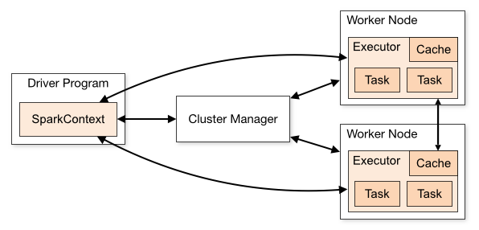

## 讲一下spark 的运行架构

- **Cluster Manager(Master)**：在standalone模式中即为Master主节点，控制整个集群，监控worker。在YARN模式中为资源管理器

- **Worker节点**：从节点，负责控制计算节点，启动Executor或者Driver。

- **Driver**： 运行Application 的main()函数

- **Executor**：执行器，是为某个Application运行在worker node上的一个进程

[参考文章](<https://juejin.im/post/5a73c8386fb9a0635e3cafaa>)